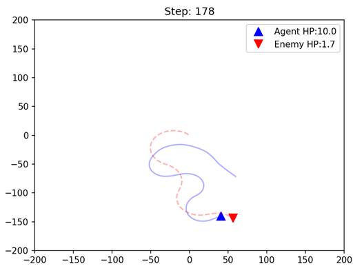

# ✈️ "Top Gun: Maveric - Dog Fight"
## 📖 프로젝트 주제 및 목표
### 🔥 2D 공중전 환경 + RL 알고리즘 + 모델 구조 + 학습 전략을 비교 분석하는 연구 프로젝트
강화학습을 활용한 자율 공중전(Dogfight) 에이전트 프로젝트입니다. 2D 공중전 시뮬레이션 환경에서, 강화학습 에이전트의 학습 효율을 극대화하는 설계 요소(환경·보상·알고리즘·모델·학습전략) 를 비교 분석하는 프로젝트입니다. 


### 🎯 프로젝트 목표
이 프로젝트는 "강화학습이 어떤 환경에서 가장 잘 학습되는가?"를 체계적으로 분석하는 실험 연구입니다.

✔ 2D 공중전 환경 직접 제작 (Gymnasium 기반)

✔ PPO vs SAC 알고리즘 성능 비교

✔ 신경망 크기에 따른 수렴효율(64/128/256 유닛) 비교

✔ 정적 학습(EASY/HARD) vs Curriculum Learning 실험

✔ 승률(Win Rate) 기반 공정한 평가 체계 구축


### 📌 프로젝트 시연 (예시)
<table>
  <tr>
    <td></td>
    <td></td>
  </tr>
</table>

<br>

## 🛠️ 설치 및 환경 설정
본 프로젝트는 `Python 3.11` 환경에서 진행되었습니다. 충돌 방지를 위해 가상환경(`Conda`, 등) 사용을 권장합니다.

1. **프로젝트 다운로드** 
```bash
git clone https://github.com/YourUsername/YourProjectName.git
cd YourProjectName
```

2. **라이브러리 설치** (가상환경 추천에서 진행하기를 추천합니다.)
```bash
# 기본 라이브러리 및 RL 프레임워크
pip install gymnasium numpy matplotlib
pip install stable_baselines3

# 시각화 및 데이터 분석용
pip install seaborn pandas
```

<br>

## 💻 파일 구조 및 주요 파일 설명
### 📁 파일 구조
원활한 코드 실행을 위한 파일 구조
```bash
Top-Gun-Maverick/
├── README.md
├── assets/
├── logs/               # Checkpoints
├── report/             # 보고서 
├── results/            # 실험 결과
│
├── dogfight_env.py
├── train.py           
├── test.py
└── evaluation.py
```

### 🎮 주요 파일 설명 
코드 보실 때 아래 순서대로 파일을 들어가서 보시면 비교적 이해하시기 편할 것 같습니다.
`dogfight_env.py` $\to$ `train.py`$\to$ `test.py` $\to$ `evaluation.py`
- **`dogfight_env.py`**: OpenAI Gym 인터페이스를 기반으로 구축된 2D 공중전 시뮬레이션 환경 및 물리 엔진/보상 함수 로직.
- **`train.py`**: 알고리즘/네트워크/난이도를 설정하여 에이전트 학습을 수행하고, Checkpoints 및 Reward 저장
- **`test.py`**: 학습된 모델을 로드하여 렌더링을 통해 에이전트의 기동을 실시간으로 시각화 및 검증.
- **`evaluation.py`**: 고정된 Random Seed와 반복 에피소드를 통해 승률(Win Rate) 등의 성능 지표를 정량적으로 측정하고 Reward 및 Win Rate 시각화

<br>

## 🚀 사용 방법
이 프로젝트는 **학습(Train)**, **시각화(Test)**, **평가(Evaluation)** 의 3단계 파이프라인으로 구성되어 있습니다.

### ⚠️ 필수 확인 사항  
- **권장 학습량**: 유의미한 전술 기동을 학습하기 위해서는 200만 Step 이상의 학습을 권장합니다. (최소 100만 Step 이상)

- **멀티 프로세싱** : `train.py`는 빠른 데이터 수집을 위해 CPU 병렬 처리를 지원합니다. 본인의 CPU 코어 수에 맞춰 `--n_envs` 옵션을 조절하세요. (권장: 전체 코어 수 - 10)

- **Checkpoints 및 실험 결과 저장소**: https://drive.google.com/drive/folders/1AXFPK7xQpnUrl42ke9HL9YrVziXlabm1?usp=sharing
    - 보고서에서 언급된 실험들의 Checkpoints가 존재합니다. 다운 받아서 `test` 및 `evaluation` 가능합니다.
    - 보고서에서 언급된 실험들의 실험 결과(Reward, Win Rate) 또한 존재합니다. 

### 1. **에이전트 학습** (`train.py`)

`train.py` 파일 하나로 **새로운 학습** 과 **이어서 학습하기** 를 모두 수행할 수 있습니다.


**[옵션 설명]**

`--difficulty`: 난이도 설정 (EASY, HARD, Curriculum_V1, Curriculum_V2 등)

`--algo`: 알고리즘 선택 (SAC, PPO)

`--steps`: 총 학습 스텝 수

`--n_envs`: 병렬로 실행할 환경 개수 (중요)

`--exp_name`: 로그가 저장될 폴더 이름

`--load_model`: 이어서 학습할 모델 경로 (없으면 새로 시작)

**A. 처음부터 학습하기**
```bash
# 예시: HARD 모드, 200만 스텝, SAC 알고리즘, CPU 10개 사용
python train.py --difficulty HARD --steps 2000000 --seed 1 --algo SAC --n_envs 10 --exp_name dogfight_sac_128_hard_seed1 --units 128
```

**B. 학습 이어서 하기**
기존 모델을 불러와서 추가로 학습하거나 난이도를 바꿔서 학습합니다.
```bash
# 예시: EASY 모델을 불러와서 HARD 모드로 100만 스텝 추가 학습
python train.py --difficulty HARD --steps 1000000 --seed 1 --algo SAC --n_envs 10 --units 128 \
--exp_name dogfight_sac_curriculum_seed1 \
--load_model ./logs/dogfight_sac_128_easy_seed1/checkpoints/dogfight_pilot_easy.zip
```
-------------
### 2. **시뮬레이션 시각화** (`test.py`)
학습된 모델이 실제로 어떻게 비행하는지 눈으로 확인합니다. (render 모드 활성화)
```bash
# 기본 사용법
python test.py --algo SAC --difficulty HARD --model_path ./logs/dogfight_sac_128_hard_seed1/checkpoints/dogfight_pilot_hard.zip --episodes 3
```

### 3. **성능 평가 및 그래프 분석** (`evaluation.py`)
여러 모델의 학습 로그(`monitor.csv`)와 체크포인트 승률을 비교 분석하여 그래프를 그립니다.

**사용방법**
- 1. `evaluation.py` 파일을 열어 상단의 `EVAL_CONFIG`의 딕셔너리에 하나의 체크포인트당 평가할 에피소드 수를 입력합니다. ("episodes": 50, 기본 설정 값은 50인데 오래 걸릴 수 있습니다.) 
- 2. `evaluation.py` 파일을 열어 상단의 `EVAL_CONFIG`의 딕셔너리에 평가하고 싶은 난이도를 입력합니다. ("difficulty": "EVAL_LV.1", "difficulty": "EVAL_LV.2" 중에 택 1)
- 3. `evaluation.py` 파일을 열어 하단의 메인 함수 내의 `experiments` 딕셔너리에 비교하고 싶은 모델 경로를 입력합니다.
```bash
experiments = {
        "SAC_Easy_128": ["logs/dogfight_sac_128_easy_seed1", "logs/dogfight_sac_128_easy_seed2", "logs/dogfight_sac_128_easy_seed3"],
        "SAC_Hard_128": ["logs/dogfight_sac_128_hard_seed1", "logs/dogfight_sac_128_hard_seed2", "logs/dogfight_sac_128_hard_seed3"],
        "SAC_Curriculum_V1_128": ["logs/dogfight_sac_128_curriculum_v1_seed1", "logs/dogfight_sac_128_curriculum_v1_seed2", "logs/dogfight_sac_128_curriculum_v1_seed3"]
}
```
- 2. 평가 스크립트 실행:
```bash
python evaluation.py
```

- 3. 실행 후 생성된 `graph_reward.png` (학습 곡선)와 `graph_winrate_png` (승률) 이미지를 확인합니다.

<br>

## ⚙️ 세부 설정 및 난이도 조절 (Configuration)

만약 100만 스텝 이상 학습시킬 시간이 부족하거나, 테스트 목적이 다를 경우 `dogfight_env.py` 내부 설정을 변경하여 난이도를 조절할 수 있습니다.

주요 파라미터 (`dogfight_env.py` $\to$ `reset` 함수)
- `my_hp`: 에이전트의 체력 (높을수록 오래 생존하여 학습 유리)
- `enemy_hp`: 적기의 체력
- `t_rate` : 선회율 (전투기가 방향을 얼마나 빠르게 바꾸는가)
- `AGENT_LOCK_ANGLE`: 에이전트의 Lock-on 가능 각도 (넓을수록 공격 쉬움)
- `ENEMY_LOCK_ANGLE`: 적의 Lock-on 가능 각도 (넓을수록 공격 쉬움)
- `prob_start`: 에이전트가 적의 뒤(유리한 위치)에서 시작할 확률

```bash
# 예시: EASY 모드를 더 쉽게 만들고 싶을 때
elif self.difficulty == "EASY":
    my_hp = 20.0  # 체력 상향
    self.LOCK_ANGLE = np.deg2rad(40) # 공격 각도 대폭 확대
    prob_start = 0.95 # 거의 항상 뒤에서 시작
```